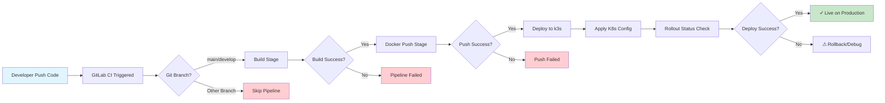
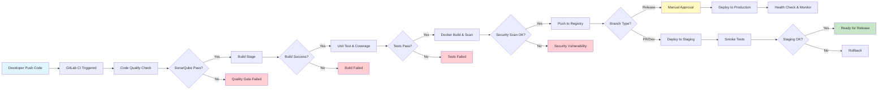

# Vehicle Rental - Deployment & CI/CD Report

## 1. Screenshots Deployment

### 1.1 Backend Deployment Screenshot (Bruno/Postman Request)
**[Tempat untuk screenshot - pastikan URL deployment terlihat jelas]**

---

### 1.2 Frontend Deployment Screenshot
**[Tempat untuk screenshot - pastikan URL deployment dan halaman terlihat jelas]**

---

## 2. CI/CD Pipeline Current Implementation

### 2.1 Pipeline Architecture (Spring Boot Backend)



### 2.2 Deskripsi Pipeline Current:

Pipeline CI/CD untuk backend Spring Boot terdiri dari 3 tahap utama:

1. **Build Stage**: Gradle clean build dengan JDK 21, menghasilkan JAR artifact (kecuali plain JAR)
2. **Docker Push Stage**: Build Docker image dan push ke Docker Hub registry
3. **Deploy Stage**: Generate ConfigMap & Secret, SCP file k8s, apply ke k3s cluster via kubectl

**Karakteristik:**
- Trigger pada branch `main` dan `develop` saja
- Menggunakan GitLab Runner dengan Docker executor
- Auto-generate credentials via printf di .gitlab-ci.yml
- Direct deployment tanpa staging environment

---

## 3. CI/CD Pipeline Improvement

### 3.1 Enhanced Pipeline Architecture



### 3.2 Improvement Details:

**Penambahan pada Pipeline:**

| Improvement | Keuntungan |
|-------------|-----------|
| **Code Quality Check (SonarQube)** | Deteksi code smells, bugs, dan vulnerabilities lebih awal |
| **Unit Test & Coverage Report** | Memastikan code reliability dan coverage minimal |
| **Docker Image Scanning** | Identifikasi security vulnerabilities di dependencies |
| **Staging Environment** | Test deployment sebelum production |
| **Manual Approval Gate** | Kontrol release ke production |
| **Smoke Tests** | Validasi critical functionality post-deploy |
| **Health Check & Monitoring** | Continuous monitoring production environment |
| **Rollback Mechanism** | Quick recovery jika deployment gagal |

**Manfaat Keseluruhan:**
- ✅ Lebih reliable dan predictable
- ✅ Security vulnerability terdeteksi lebih awal
- ✅ Reduced downtime dengan staging environment
- ✅ Better control dengan approval gates
- ✅ Observability yang lebih baik

---

## 4. Elastic IP pada EC2 Instance

### Mengapa menggunakan Elastic IP?

**Alasan Penggunaan:**
1. **Fixed IP Address**: Elastic IP tetap sama meskipun instance restart/stop-start
2. **DNS Mapping**: Dapat bind ke domain name (ingress host) yang konsisten
3. **High Availability**: Jika instance gagal, dapat remap Elastic IP ke instance baru tanpa update DNS
4. **Predictability**: Ingress dan firewall rules tidak perlu update setiap kali instance restart

**Tanpa Elastic IP (Public IP biasa):**
- IP address berubah setiap kali instance stop → start
- DNS records akan invalid
- Ingress host akan tidak accessible
- Perlu update security groups dan DNS setiap restart
- Downtime dan kompleksitas operational meningkat

**Kesimpulan:** Elastic IP essential untuk production environment dengan fixed domain names.

---

## 5. Perbedaan Docker dan Kubernetes pada Praktikum

| Aspek | Docker | Kubernetes |
|-------|--------|-----------|
| **Scope** | Container runtime & packaging | Container orchestration & management |
| **Deployment** | Run image per container di server | Manage banyak container across nodes |
| **Scaling** | Manual scaling (docker run) | Auto-scaling via ReplicaSet |
| **Load Balancing** | Manual port mapping | Service abstraction (ClusterIP, NodePort, LoadBalancer) |
| **Config Management** | Environment variables | ConfigMap & Secret objects |
| **Health Management** | Restart policy basic | Probes (liveness, readiness), auto-restart |
| **Update Strategy** | Manual blue-green atau downtime | Rolling updates, canary deployment |
| **Networking** | Direct port exposure | Service mesh, DNS internal |
| **Storage** | Volume management simple | PersistentVolume & PersistentVolumeClaim |
| **Use Case** | Development, simple deployments | Production, complex, scalable systems |

**Pada Praktikum Ini:**
- **Docker**: Containerize aplikasi (Spring Boot BE, Vue.js FE), database (PostgreSQL)
- **Kubernetes (k3s)**: Orchestrate container deployment, auto-restart, expose via Ingress, manage secrets & configs

---

## 6. Proses Paling Penting dalam Pipeline

### Jawaban: **Docker Build & Push Stage**

**Alasan:**

1. **Bridge antara Code dan Deployment**: Mengubah code menjadi deliverable artifact (Docker image)
2. **Versioning**: Image tag dengan commit SHA memastikan traceability
3. **Reproducibility**: Dependency lock di Docker image = consistent deployment di any environment
4. **Security Gate**: Docker image scan sebelum push (jika implemented)
5. **Single Source of Truth**: Image di registry adalah source of truth untuk production
6. **Rollback Capability**: Dapat rollback ke image versi sebelumnya dengan cepat

Tanpa Docker image yang reliable, deploy ke k8s menjadi risky dan unpredictable.

---

## 7. Penjelasan 5 File Konfigurasi Kubernetes

### 7.1 **deployment.yaml** (Repository k8s/)
**Fungsi:** Define pod specifications dan deployment strategy
```yaml
- Spec container (image, port, resources)
- Replica count untuk scaling
- Environment variables untuk runtime config
- Mount points untuk volume/config
```
**Kegunaan:** Core definition dari aplikasi yang akan di-deploy

### 7.2 **service.yaml** (Repository k8s/)
**Fungsi:** Expose aplikasi internally atau externally
```yaml
- Define service type (ClusterIP untuk internal)
- Map port eksternal ke container port
- Label selector untuk pod routing
```
**Kegunaan:** Traffic routing dari user/service ke pod

### 7.3 **ingress.yaml** (Repository k8s/)
**Fungsi:** External HTTP/HTTPS routing dengan domain name
```yaml
- Domain mapping (2306245592-vehicle-rental-be.hafizmuh.site)
- Path-based routing
- TLS termination (jika configured)
```
**Kegunaan:** Public access ke aplikasi via domain + traefik controller

### 7.4 **configmap.yaml** (Generated di .gitlab-ci.yml)
**Fungsi:** Non-sensitive configuration data
```yaml
- DATABASE_URL_PROD: jdbc:postgresql://host:5432/db
- DATABASE_USERNAME: vehicle-rental-dev
- NODE_ENV: production
```
**Kegunaan:** Decouple config dari image, enable environment-specific setup

### 7.5 **secret.yaml** (Generated di .gitlab-ci.yml)
**Fungsi:** Sensitive credentials & secrets
```yaml
- DATABASE_PASSWORD: encrypted value
- API_KEYS: base64 encoded
- JWT_SECRET_KEY: secure random key
```
**Kegunaan:** Store credentials securely, not hardcoded in image

**Alur Integration:**
```
deployment.yaml ← (references) → configmap.yaml + secret.yaml
                                       ↓
                  Applied to k3s cluster via kubectl
                                       ↓
                  Pod launches dengan env var dari config & secret
```

---

## 8. Start on Restart Implementation

### 8.1 **Docker Compose (Database)**

**File: docker-compose.yml**
```yaml
services:
  vehicle-rental-db:
    restart: 'no'  # ← Restart policy
```

**Implementasi:**
- `restart: 'no'` (default) - tidak auto-restart
- Untuk auto-restart, ganti ke `restart: always`
- Atau gunakan `restart: unless-stopped` untuk production

**Alternatif via systemd:** Jalankan docker-compose dengan systemd unit file untuk auto-start on host reboot:
```ini
[Service]
Type=oneshot
ExecStart=/usr/local/bin/docker-compose -f /path/to/docker-compose.yml up -d
RemainAfterExit=yes
```

### 8.2 **Kubernetes Deployment**

**File: k8s/deployment.yaml**
```yaml
spec:
  replicas: 1
  selector:
    matchLabels:
      app: vehicle-rental-2306245592-be
  template:
    spec:
      containers:
      - name: springboot-container
        imagePullPolicy: Always  # ← Pull latest image
```

**Implementasi Start on Restart di k3s:**
1. **ReplicaSet Controller**: Memastikan always ada 1 pod running
   - Jika pod crash → otomatis restart
   - Jika node down → reschedule ke node lain

2. **Liveness Probe** (di deployment):
   ```yaml
   livenessProbe:
     httpGet:
       path: /health
       port: 8080
     initialDelaySeconds: 30
     periodSeconds: 10
   ```
   - Kubernetes restart pod jika liveness probe gagal

3. **Persistent Storage**: Jika ada database, gunakan PersistentVolume
   - Data tetap survive pod restart

**Perbedaan Default Behavior:**
- **Default Docker/K8s**: Crash = pod mati (harus manual restart)
- **Dengan restart policy + ReplicaSet**: Crash = otomatis restart dalam seconds

---

## 9. Keuntungan Kubernetes vs Docker Langsung

### Keuntungan Kubernetes:

| Fitur | Keuntungan |
|-------|-----------|
| **Auto Healing** | Pod yang crash otomatis restart tanpa manual intervention |
| **Load Balancing** | Traffic distribution otomatis across replicas |
| **Rolling Updates** | Zero-downtime deployment dengan gradual pod replacement |
| **Resource Management** | CPU/memory limits enforcement, bin packing optimization |
| **Service Discovery** | DNS-based service discovery, tidak perlu hardcode IP |
| **Scaling** | `kubectl scale deployment` atau HPA untuk auto-scaling |
| **Multi-node** | Run container across cluster, failover otomatis |
| **Declarative Config** | Infrastructure as Code, version control friendly |
| **Rollback** | Instant rollback ke deployment versi sebelumnya |
| **Monitoring & Logging** | Built-in integration untuk observability |

### Perbandingan Direct Docker Run:
```bash
# Direct Docker (Limited)
docker run -d --restart=always vehicle-rental:v1
# → Single node, manual scaling, manual updates, manual failover

# Kubernetes (Powerful)
kubectl apply -f deployment.yaml
# → Multi-node, auto-scaling, zero-downtime updates, auto-failover
```

**Kesimpulan:** Kubernetes ideal untuk production, multi-service, high-availability systems.

---

## 10. Perbedaan Tipe Service Kubernetes

### 10.1 **ClusterIP** (Default)
```yaml
type: ClusterIP
spec:
  ports:
  - port: 80
    targetPort: 8080
```
**Karakteristik:**
- Internal only (accessible hanya dari dalam cluster)
- Virtual IP stabil (tidak real IP)
- DNS: `service-name.namespace.svc.cluster.local`
- Port mapping: 80:8080

**Gunakan untuk:** Internal service communication

### 10.2 **NodePort**
```yaml
type: NodePort
spec:
  ports:
  - port: 80
    targetPort: 8080
    nodePort: 30000  # 30000-32767
```
**Karakteristik:**
- Expose pada setiap node IP
- Accessible dari luar cluster: `NodeIP:30000`
- Auto-routing ke pod di any node

**Gunakan untuk:** Testing, development environments

### 10.3 **LoadBalancer**
```yaml
type: LoadBalancer
spec:
  ports:
  - port: 80
    targetPort: 8080
```
**Karakteristik:**
- Cloud provider allocate external IP
- Real load balancer (ELB di AWS, LB di GCP)
- High cost tapi professional
- Automatic failover & health check

**Gunakan untuk:** Production dengan requirement external traffic

---

### 10.4 Mengapa ClusterIP untuk Praktikum?

**Alasan:**

1. **Ingress Controller Handling**: Ingress (traefik) handle external traffic
   ```
   Client → Ingress (Traefik) → ClusterIP Service → Pod
   ```

2. **Cost Efficiency**: Tidak perlu load balancer eksternal ($$)

3. **Centralized Routing**: Ingress controller (traefik) provide:
   - Domain mapping
   - Path-based routing
   - SSL/TLS termination
   - Rate limiting

4. **Architecture**: ClusterIP + Ingress = production-grade pattern

5. **Simplicity**: K3s + traefik sudah include ingress controller

**Flow Praktikum:**
```
External Request → domain (DNS) → Ingress Rule → Service (ClusterIP) → Pod
```

---

## 11. Pelajaran Terpenting CI/CD

### Pelajaran Utama:

**1. Automation Saves Time & Reduces Errors**
- Manual deployment rentan kesalahan (typo, forgot step, inconsistency)
- Automated pipeline repeatable dan reliable
- Self-documenting (YAML files = infrastructure as code)

**2. Separation of Concerns**
- Build ≠ Test ≠ Deploy (clear boundaries)
- Setiap stage punya responsibility jelas
- Easier to debug dan fix issues

**3. Version Control Everything**
- Docker image tag = code version (commit SHA)
- Rollback instant ke working version
- Audit trail lengkap

**4. Fail Fast, Fail Safe**
- Early detection dari issues (code quality, tests, security scan)
- Prevent broken code reaching production
- Cost efficiency (fix early = cheaper)

**5. Infrastructure as Code**
- k8s config files = source control
- Reproducible deployments
- Documentation built-in

### Aplikasi pada Proyek Lain:

**Framework CI/CD Universal:**
```
1. Build Stage: Compile & package aplikasi
   - Node.js: npm run build
   - Go: go build
   - Python: pip install + create wheel

2. Test Stage: Run tests & validate
   - Unit tests, integration tests
   - Code coverage report
   - Static analysis (SonarQube, ESLint, etc)

3. Artifact Stage: Create distributable
   - Docker image untuk containerized apps
   - JAR/WAR untuk Java
   - Binary untuk compiled languages

4. Registry Stage: Push ke artifact storage
   - Docker Hub, ECR untuk images
   - Nexus, Artifactory untuk artifacts
   - PyPI untuk Python packages

5. Deploy Stage: Release ke environment
   - Dev → Staging → Production
   - Approval gates untuk production
   - Health checks & smoke tests

6. Monitor Stage: Continuous observation
   - Logs, metrics, traces
   - Alert on anomalies
   - Rollback on failure
```

**Best Practices Applicable ke Proyek Lain:**
- ✅ Keep pipelines DRY (Don't Repeat Yourself)
- ✅ Fail fast dengan early validation
- ✅ Use declarative config (YAML, HCL, JSON)
- ✅ Version everything (code, config, container images)
- ✅ Implement least privilege (secrets management)
- ✅ Monitor & observe production continuously
- ✅ Plan for rollback & disaster recovery
- ✅ Automate everything possible, approve only critical gates
